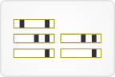

# [Chronology View](http://vizome.org/aml/chronology/)

## 

### Data
This view displays DNA variants for a given gene, sorted by sample date for each patient.

Sample attributes can be shown by making selections in the "Sample attributes" drop-down menu.

Fusions for the current gene can be shown.

Global filters affect this view. Any sample-based filters set [here](http://vizome.org/aml/) and/or variant filters set [here](http://vizome.org/aml/variant_filter/) determine what patients and variants appear in this view. If no global filters are set, all are shown.

### Visuals
If a global sample group comparison is active, the patient IDs are color-coded by group.

Each patient has one row, and for each sample they have, a light gray box appears in the "Timepoint" columns. The box represents the length of the gene. If that sample contains a variant in this gene, a black rectangle appears at the variant's position in the gene.

When fusions are shown, dotted magenta lines appear at their positions in the gene.

When sample attributes are selected via the drop-down menu at right, the light gray "Timepoint" boxes will be color-coded according to the chosen attribute.

### User interactions
The  icon after the gene name at the top of the page links to the GeneCards entry for this gene.

Clicking the "Show fusions" button at right will reveal fusions, if any are present in the gene.

Mousing over a "Timepoint" box will open a zoomed-in view of that timepoint. Variants in the zoomed-in view are color-coded according to variant type, and mousing over them hides other variants while keeping that particular variant displayed in all other patients.

Clicking on a variant or fusion in the zoomed-in view will replace this view with the individual-based gene model view.

Clicking on the small green arrow above a single variant in the zoomed-in view will export CSV data for samples with that particular variant.

Variant types can be toggled on/off with the checkboxes at right.

Sample attributes can be chosen from the drop-down menu at right, and the "Timepoint" boxes will be color-coded accordingly.

Clicking the export button  will prepare a CSV of the variants for this gene.