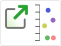
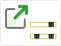
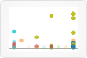
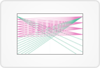
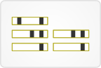
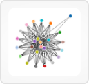
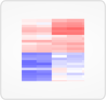

# [Gene Sets](http://vizome.org/aml/geneset/)

## 

### Data
This view allows you to define a set of genes, or to select a pre-defined set, which you may then explore in a variety of ways.

Global filters do not affect this view, and this view does not set any global filters.

### User interactions
Add or remove genes from a set by typing in the large text box at top left, separating them with commas or line breaks. You may also add genes by selecting them from the drop-down menu (start typing to narrow the choices).

Give the set a name, if desired, in the small text box below. This name will appear in new windows opened from this page, however it is not saved in the system for future use.

Alternatively (or in addition), click on one of the pre-defined custom gene sets to load the genes in that set.

Once your gene set has been entered, choose an option to work with it.

These four buttons:     open the gene set as a custom frequency view, an interactions/pathways view, a chronology set view, or a network/expression view, respectively. These buttons will open a new window when clicked.

Clicking the export buttons  will prepare a CSV of the corresponding variants for all genes in the set.

##  [Gene Set Variants View](http://vizome.org/aml/genes_variants/)

### Data
This view shows both the frequency and type of unique DNA variants within a given list of genes. Uniqueness is determined by the combination of chromosome, reference allele, alternative allele, start position, and end position.

It also displays gene frequencies, calculated as the number of samples with a variant in that gene divided by the total number of samples. The count of samples with a variant in that gene is taken after global filters have been applied.

If a global sample filter is active, it also displays group comparisons.

Global filters affect this view. Any sample-based filters set [here](http://vizome.org/aml/) and/or variant filters set [here](http://vizome.org/aml/variant_filter/) determine what variants appear in this view. If no global filters are set, all are shown.

### Visuals
Each unique DNA variant within the selected genes is plotted with cohort frequency on the y-axis and gene name on the x-axis. Variants are color-coded by type.

The number in parentheses after each gene name indicates the number of unique variants in the gene.

In the comparison plot, if applicable, each unique DNA variant is again color-coded by type and plotted with the gene name on the x-axis, but the y-axis represents the difference in group frequencies.

The bottom plot displays gene frequencies.

### User interactions
All variant types can be shown/hidden with the checkboxes at right.

Drag an area of the gene frequency plot to select a subset of genes and view more information about them, and/or export data from that selection.

Clicking on a gene name will bring up a set of options for that gene: View gene model, View interactions, View chronology, and go to GeneCards page.

Clicking the "Edit gene set" button  will allow you to edit the gene list in a new window.

Clicking export buttons  will prepare a CSV of the corresponding variants for all listed genes.

##  [Gene Set Interactions/Pathways View](http://vizome.org/aml/related/)

### Data
This view first displays interactions, as defined by gene interaction data derived from [Pathway Commons](http://www.pathwaycommons.org/). Interactions in this view have been limited to those between members of a pathway, and to three interaction types: "controls state change," "controls expression," and "interacts."

The presence of variants in the interacting genes can be indicated in this view.

If a subset of interacting genes are selected, pathway names and a count of their gene members can be displayed, as well as a heatmap of expression.

Global filters affect this view. Any sample-based filters set [here](http://vizome.org/aml/) and/or variant filters set [here](http://vizome.org/aml/variant_filter/) determine what variants appear in this view. If no global filters are set, all are shown.

### Visuals
In the "String view" plot, genes are sorted into groups: those that control other genes, those that are both controlled by and control other genes, and those that are controlled by other genes. These three groups are arranged on axes from left to right, with the direction of control pointing right.

On the middle axis, interaction lines end in arrows to indicate direction of control.

Interactions are color-coded by type.

A black circle underneath the gene name indicates the presence of variants when "Show variants" is checked.

### User interactions
Each type of interaction can be shown/hidden with the checkboxes in the string plot.

Variants in a gene can be shown/hidden with the "Show variants" checkbox.

Clicking on a gene name will hide interactions not involving that gene.

Click "Show all interactions" to restore hidden interactions.

#### Selected genes
This view supports the creation of a set of selected genes, and you can select a gene in three ways: 1) Clicking on its gene name in the string plot, 2) Selecting it from the drop-down menu under the string plot, or 3) Clicking "Select all." Selected genes appear below the string plot.

Clicking on a gene name in the selected genes list will display a set of links for that gene: View gene model, View interactions, View chronology, and Go to GeneCards.

Genes can be removed from the selected genes list by clicking the "x" after their names, or you may remove all of them by clicking "Clear list."

When a set of genes (or a single gene) has been selected, a heatmap of RNA-Seq expression will also be generated below the string plot.

Clicking the "Create gene set" button will take you to the gene set page, which will be populated with the list of currently selected genes.

#### Pathways
Every time a gene is added to or removed from the selected genes list, Vizome checks to see if any pathways contain all of the selected genes. If so, a list of those pathways will appear on the top right.

Clicking on the small green arrow at the end of the pathway name will export a list of that pathway's gene members with a count of samples with variants per gene.

Clicking on the pathway name itself will open a pathway view in a new window.

##  [Gene Set Chronology View](http://vizome.org/aml/chronology_set/)

### Data
This view displays DNA variants for a set of genes, sorted by sample date for each patient.

Sample attributes can be shown by making selections in the "Sample attributes" drop-down menu.

Fusions for the current gene can be shown.

Global filters affect this view. Any sample-based filters set [here](http://vizome.org/aml/) and/or variant filters set [here](http://vizome.org/aml/variant_filter/) determine what patients and variants appear in this view. If no global filters are set, all are shown.

### Visuals
If a global sample group comparison is active, the patient IDs are color-coded by group.

Each patient has one row, and for each sample they have, a light gray box appears in the "Timepoint" columns. The box represents the length of the gene. If that sample contains a variant in this gene, a black rectangle appears at the variant's position in the gene.

When fusions are shown, dotted magenta lines appear at their positions in the gene.

When sample attributes are selected via the drop-down menu at right, the light gray "Timepoint" boxes will be color-coded according to the chosen attribute.

Every five seconds, the view will advance to the next gene in the list.

### User interactions
The  icon after the gene name at the top of the page links to the GeneCards entry for this gene.

Auto-advancing through genes can be paused by clicking the pause button  and started again by clicking the play button .

Gene names in the list at left can be clicked to view them in any order, and doing so will pause auto-advancing.

Mousing over a "Timepoint" box will also pause auto-advancing, and will open a zoomed-in view of that timepoint. Variants in the zoomed-in view are color-coded according to type, and mousing over them hides other variants while keeping that particular variant displayed in all other patients.

Clicking the "Show fusions" button at right will reveal fusions, if any are present in the gene.

Clicking on a variant or fusion in the zoomed-in view will replace this view with the individual-based gene model view.

Clicking on the small green arrow above a single variant in the zoomed-in view will export CSV data for samples with that particular variant.

Variant types can be toggled on/off with the checkboxes at right.

Sample attributes can be chosen from the drop-down menu at right, and the "Timepoint" boxes will be color-coded accordingly.

Clicking the export button  will prepare a CSV of the variants for this gene.

Clicking on the "Export summary" button under the gene list at left will export a CSV summary with all genes in the set as columns, patients as rows which are grouped by timepoint, a count of the total variants per row, and the ref/alt alleles for each variant.

##  [Gene Set Networks View](http://vizome.org/aml/network_expression/)

### Data
This view initially displays undirected [Pathway Commons](http://www.pathwaycommons.org/) interactions among the genes in the set passed in.

It can display a heatmap of expression for any genes in the set, as well as for genes found in downstream interactions for one particular gene.

When looking for downstream interactions, the type of Pathway Commons interactions can be any or all of the following: "controls expression of," "controls state change of," "catalysis precedes," "controls phosphorylation of," or "controls transport of."

Global filters affect this view. Any sample-based filters set [here](http://vizome.org/aml/) and/or variant filters set [here](http://vizome.org/aml/variant_filter/) determine what variants can be overlaid on the main heatmap plot.

### Visuals
In the network plot, genes are shown as circles, with undirected interactions as lines connecting them. If a gene is in the original set of genes passed in to this view, it will appear as a colored circle with a label. If a gene was not in the original set, it appears as a gray, unlabeled circle.

The heatmaps show clustered genes and samples, with cells in the matrix color-coded by expression.

### User interactions
The list of genes at top left offers options to add and remove genes from both the network and expression plots. You can also select/de-select all genes using the checkboxes at top.

If a small number of genes are selected for the network plot and there are not many interactions among them, the "Expand network" option may become active. Click on that link to broaden the search for interactions by looking one level out from the selected genes.

Mousing over a gray, unlabeled circle in the network plot will display the gene name.

Clicking on a gene name in the list opens a dialog box with options for retrieving downstream expression. Select which interaction types to include, and then click "Submit." If downstream genes are found, and they number less than 500, a downstream expression heatmap will appear below.

Click and drag over an area in a heatmap to reveal samples and genes in that area. You can also download the data just from that area.

##  [Gene Set Fusions View](http://vizome.org/aml/fusions/)

### Data
This view displays fusions identified by the TopHat-Fusion algorithm.

Global filters affect this view. Any sample-based filters set [here](http://vizome.org/aml/) determine what fusions appear in this view. If no sample-based filters are set, all fusions are shown.

### Visuals
The color of a fusion line corresponds to the chromosome its left gene is on.

The width of a fusion line corresponds to the number of samples containing that fusion.

### User interactions
Mousing over a fusion line displays information about it: the left and right genes, a colored line corresponding to the left gene chromosome, and the total number of samples with that fusion.

Clicking on a fusion will open a new window with either a split-view of the left and right genes, or a single gene model view if the left and right genes are on the same chromosome and close enough together.

Clicking the export button  will prepare a CSV of the fusion data currently displayed.

##  [Gene Set High-Variance Expression View](http://vizome.org/aml/expression_variance/)

### Data
The data was collated from featureCounts matrices derived from the subjunc alignments and all genes with no counts across the samples were excluded. Genes with duplicate gene symbols and those where the counts were < 10 for 90% or more of the samples were additionally removed prior to normalization. Samples for which their median expression was less than 2 standard deviations below the average were removed from the dataset (N=10). Normalization was performed using the conditional quantile normalization procedure which produced GC-content corrected log2 reads per kilobase per million mapped reads (RPKM) values. Note batch correction was not performed at this time as the known technical variables clustered fairly randomly for both hierarchical clustering of the top 2,000 most variable genes as well as in an MDS plot of the top 500 genes.

Genes are ranked by the variance of the resulting values for expression across samples. The top 1000 genes with highest variance are displayed in this view, clustered by gene and sample.

Clinical data can be added as the first rows of the plot.

Global sample-based filters affect this view. Any sample-based filters set [here](http://vizome.org/aml/) determine what samples (and therefore what genes) are included in this view. If no sample-based global filters are set, all are shown.

Note: if a global sample group comparison is active, the groups are annotated in the expression results, but the results are not clustered according to the groups.

### Visuals
Expression values and clinical data are color-coded in tabular form.

### User interactions
Drag a clinical data category to the container at right to add it to the plot. You may also expand categories by clicking on the "+", which will then allow you to drag over single values.

Clicking "Create plot" will initiate the ranking and clustering of genes and samples.

After the plot appears, click and drag over an area to display the genes and samples within. This will also allow you to download data just for those genes and samples in the selected area.

