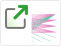

# [Gene Sets](http://vizome.org/aml/geneset/)

## 

### Data
This view allows you to define a set of genes, or to select a pre-defined set, which you may then explore in a variety of ways.

Global filters do not affect this view, and this view does not set any global filters.

### User interactions
Add or remove genes from a set by typing in the large text box at top left, separating them with commas or line breaks. You may also add genes by selecting them from the drop-down menu (start typing to narrow the choices).

Give the set a name, if desired, in the small text box below. This name will appear in new windows opened from this page, however it is not saved in the system for future use.

Alternatively (or in addition), click on one of the pre-defined custom gene sets to load the genes in that set.

Once your gene set has been entered, choose an option to work with it.

These four buttons:     open the gene set as a custom frequency view, an interactions/pathways view, a chronology set view, or a network/expression view, respectively. These buttons will open a new window when clicked.

Clicking the export buttons  will prepare a CSV of the corresponding variants for all genes in the set.