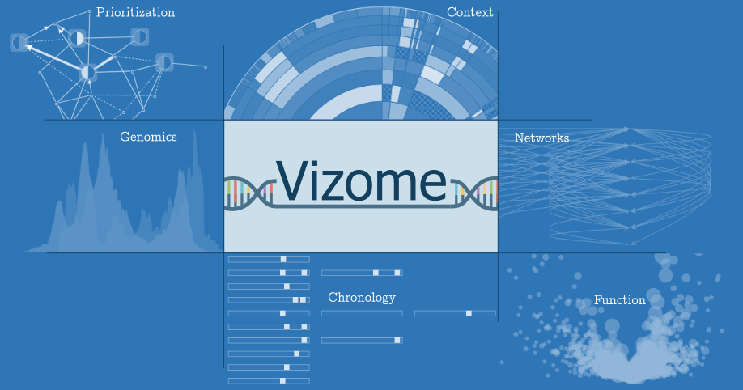

# Welcome to [**Vizome**](http://www.vizome.org)

Vizome is an interactive, context-aware knowledge discovery platform created by Libbey White, Beth Wilmot, Dan Bottomly, and Shannon McWeeney at Oregon Health & Science University.

The two datasets currently available in Vizome are [Beat AML](http://vizome.org/aml/) ([Tyner et al., *Nature* 2018](https://www.nature.com/articles/s41586-018-0623-z)) and [Crenolanib](http://vizome.org/crenolanib/) ([Zhang et al., *Nat Commun.* 2019](https://www.nature.com/articles/s41467-018-08263-x)). 

The links in this documentation point to the Beat AML Vizome, but the information is similar for Crenolanib.

Much of this documentation can also be accessed in Vizome by clicking the  button on each page.

 

## Summary of Modules in Vizome

###  1. [Sample attributes view](samples.md)
This view provides several methods to define a global filter that will limit browsing in Vizome to a subset of samples.

###  2. [Variant filters and search](variants.md)
This page presents options for defining global filters based on variant properties, as well as options for searching for variants.

###  3. [Gene sets](gene_sets.md)
This view allows you to define a set of genes, or to select a pre-defined set, which you may then explore in a variety of ways.

###  4. [Mosaic view](mosaic.md)
This view displays data related to samples, including clinical and variant, and fusion data (if applicable).

###  5. [Individual view](individual.md)
This view displays variants and inhibitor results for an individual, one patient at a time.

###  6. [Compare gene variants view](compare.md)
This view allows you to compare a set of genes selected via DNA variants found in either individual samples or groups of samples.

###  7. [Expression stratification view](expression.md)
This view displays RNA-Seq expression for a given gene and various sample attributes.

###  8. [Chronology view](chronology.md)
This view displays DNA variants for a given gene, sorted by sample date for each patient.

###  9. [Gene model view](gene_model.md)
This view displays gene models, variants, DNA coverage, miRNA, CTCF, target regions, DNase, H3K27ac, and, if applicable, RNA coverage, fusions, splicings, and a heatmap of RNA-Seq expression.

###  10. [Protein view](protein.md)
For a given gene, this view displays Pfam domains of the protein it codes, and variants in the study population. 

###  11. [Inhibitor view](inhibitor.md)
Results from inhibitor testing, variant data, and normalized RNA-Seq expression data appear in this view.

###  12. [HitWalker](hitwalker.md)
This view provides an interface to the [HitWalker](https://www.ncbi.nlm.nih.gov/pmc/articles/PMC3570211/) program, which ranks genes containing variants with respect to functional data or supplied gene sets.

 

## Getting Started

See [tutorials](tutorials.md) page for instructions and examples.