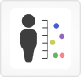

# [Individual View](http://vizome.org/aml/individual/)

## 

### Data
This view displays variants and inhibitor results for an individual, one patient at a time.

If a patient has more than one sample, variants from all samples are shown, and mean AUC for inhibitor results.

Comparisons between DNA and RNA variants will be shown if a patient has both variant types.

Comparisons across samples can be shown if the patient has more than one sample with DNA variants.

Global filters affect this view. Any sample-based filters set [here](http://vizome.org/aml/) and/or variant filters set [here](http://vizome.org/aml/variant_filter/) determine what variants appear in this view. If no global filters are set, all are shown.

### Visuals
#### Variants
A plot at the top shows of the number of DNA variants per patient for all patients, separated by somatic vs tumor-only samples. The currently selected patient is outlined in red.

Below that, each DNA variant for the currently selected patient is plotted with cohort frequency on the y-axis and gene name on the x-axis. Variants are color-coded by type.

The number in parentheses after each gene name indicates the number of variants in the gene.

If a patient has both DNA and RNA variants, the summary displays one plot with variants present only in DNA, and one plot showing variants found in both RNA and DNA (if any).

#### Sample differences
If a patient has more than one sample with DNA variants, differences across those samples can be shown. The samples will appear from left to right, in chronological order, and genes appear from top to bottom. Circles indicate variants, with the color determined by the type of variant, and the size determined by the allele frequency (larger circles correspond to higher allele frequencies).

If the allele frequency of a particular variant varies less than 0.1 across samples, that variant is considered "unchanged," and will be hidden by default.

If more than one unique variant appears within a gene, more than one circle will appear, and they will be connected by a line. Position of each variant will remain consistent on that line, enabling comparison of presence/absence of each unique variant.

#### Inhibitors
Mean AUC results are shown for patients with inhibitor results.

### User interactions
#### Variants
Variant types can be shown/hidden with the checkboxes at right.

Clicking on a gene name will bring up a set of options for that gene: View gene model, View interactions, View chronology, and go to GeneCards page.

If a patient has more than one sample with DNA variants, a button labeled, "Show samples separately" will appear. Click that button to view the samples separately.

Clicking the "DNA" export button will prepare a CSV of the DNA variants.

Clicking the "Edit gene set" button will allow you to edit the gene list in a new window.

#### Inhibitors
View inhibitor results, if any, by clicking the "Inhibitors" button.

If a patient has results from many inhibitors, the plot will be condensed, and you may click and drag a subset of it to view and export drug results.