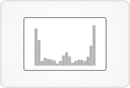

# [Inhibitor View](http://vizome.org/aml/inhibitor/)

## 

### Data
Results from inhibitor testing, variant data, and normalized RNA-Seq expression data appear in this view.

Pathway data can also be displayed in the Matrix tab.

Global filters affect this view. Any sample-based filters set [here](http://vizome.org/aml/) and/or variant filters set [here](http://vizome.org/aml/variant_filter/) determine what samples and variants appear in this view.

### Visuals
#### Inhibitor results
The results for all tested samples appear below the "Inhibitors" drop-down menu, after an inhibitor has been selected.

If a subset (highest or lowest x %) of samples is selected, that subset is checked for variants. All genes containing the resultant variants are identified as "genes of interest," and all samples are then checked to see if they have variants in those genes. A plot of all samples appears, showing inhibitor results on the y-axis and the number of "genes of interest" they have variants in on the x-axis. The samples in the selected subset are purple, all other samples are light gray. Below this plot is a list of the "genes of interest."

#### Stratify
Inhibitor results are plotted with the selected sample attribute (ELN2017, by default), with a dotted median line for each group if the selected attribute is categorical.

#### Single genes
Selecting a gene in the "Single genes" tab displays a box with two groups of samples on the top plot (those with variants in the selected gene, and those without). Those with variants show in red. In the bottom plot, RNA-Seq expression values are plotted on the x-axis, and inhibitor results on the y-axis. The symbols shown in this plot correspond to presence/absence of variants or expression-only samples.

#### Conditional
The first gene selected in the "Conditional" tab affects the plot for all subsequently selected genes. Samples are divided into two horizontally spaced groups: those with variants in the first selected gene, and those without. Y-axis positions represent inhibitor results. Variants in subsequently added genes are color-coded by gene, and appear in one of the two groups according to whether or not the sample has a variant in the first selected gene.

#### Volcano/frequency plots
Two variations of volcano plots can be shown: single gene, all drugs; and single drug, all genes. A frequency plot of all genes, all drugs can also be shown. Sensitive samples are red, resistant samples are blue. However, if any global filters are active, the plots will have absolute value of t-statistic on the y-axis (rather than -log10(FDR) values), and samples will not be color-coded.

#### Matrix
The "Matrix" tab offers a variety of options for viewing combinations of inhibitor, variant, and pathway data in matrices.

By default the first option ("Variants") shows a dark square for variants appearing in a given sample (column) - gene (row) combination. Samples are ordered from left to right by inhibitor drug results, and genes are ordered by odds ratio, highest to lowest, from top to bottom. The subset of samples in the previously selected range (highest or lowest x %) are indicated with a shaded blue area. Within this "Variants" option, color-coded RNA-Seq expression data can be overlaid on the dark variant squares. The expression in this context is coded as "low," "medium," or "high" expression. Also within the "Variants" option, pathway data can be added, and the rows are then pathways ranked by odds ratio, highest to lowest, from top to bottom. Samples, as columns, are still ordered from left to right by inhibitor drug results. Shades of green on the individual squares encode the number of genes a given sample has variants in, for that pathway. An additional layer of information for each pathway can be accessed, which includes both a gene-sample grid (which can be compared with another pathway), and a gene frequency plot.

The "Expression" option within the "Matrix" tab presents a variety of visuals as well. By default the first one is a heatmap of RNA-Seq expression data, with samples ordered from left to right by inhibitor drug results, and a subset of genes clustered by expression. The subset of samples in the previously selected range (highest or lowest x %) are indicated with a shaded blue area. Variants can be overlaid on this heatmap, and appear as black circles. Samples can also be clustered by expression, rather than ordered by inhibitor drug results. In that case, a grayscale row of inhibitor drug results for each sample appears at the bottom of the plot.

#### Tumor only
Selecting a gene when the "Tumor only" tab is active displays the same plot that's shown in the top of a "Single genes" plot, with samples divided into two groups (those with variants in the selected genes and those without). However, now tumor only variants are overlaid on the plot, in green. If no tumor only variants are found, a message will indicate that.

#### Gene set
Selecting genes in the "Gene set" tab will display a summary plot of mean inhibitor results, as well as individual sample inhibitor results and highest-per-sample allele frequencies, for those genes. Individual gene plots with inhibitor results and highest-per-sample allele frequencies can be shown as well.

### User interactions
#### Inhibitor results
At the top left, the measure for inhibitor results can be selected: IC50, IC75, IC90, or Area under curve.

After selecting an inhibitor from the drop-down menu, if there are samples with results for that inhibitor that also have genotypes, the option to select a subset of those samples (highest or lowest x %) appears. Enter a percentage (or the default 10%), and select highest or lowest, then click "Submit."

This brings up a new plot showing inhibitor results on the y-axis and the number of genes they have variants in on the x-axis. Click on the export button  to download a CSV with patient IDs, sample IDs, inhibitor results, and variant counts.

Mousing over the circles on the plot will display their sample ID.

Below the plot, a list of genes with variants from the selected subset of samples appears. This list can be downloaded as a CSV file by clicking the export button, or opened as a custom gene set by clicking on the "Create gene set" icon: . The list can be sorted alphabetically by gene, or by number or samples with variants in that gene, by clicking on the column headings at top.

Mousing over gene names or sample counts in the list displays a yellow outline around the corresponding sample circles in the plot above. All samples with variants in the moused-over gene have a yellow outline, not just those in the selected subset.

Clicking on the sample count in the list opens a dialog box containing information about which samples they are, and which other genes all of those samples have variants in.

#### Stratify
Select a sample attribute from the drop-down menu to stratify samples accordingly.

#### Single genes
Clicking on a gene name in the list at left, or selecting a gene from the drop-down in the "Single genes" tab adds a plot to the page.

The plot can be removed by clicking the "close" icon: . Or click the "Remove all" button to remove all single gene plots.

Within this plot, clicking on a red circle (signifying a sample with a variant) opens a new page with the corresponding gene model view.

Clicking the "proceed" icon:  opens a new view with results from all inhibitors for that gene.

Download the data in both the variant/inhibitor plot and the RNA-Seq expression plot by clicking the export button at the bottom right of each pair of plots.

#### Conditional
After switching to the "Conditional" tab, clicking on a gene name in the list at left starts the conditional plot. Subsequently clicked gene names add color-coded circles to the plot, and mousing over their labels will highlight the corresponding circles.

#### Volcano/frequency plots
A frequency plot of all genes and all drugs is displayed by default, if no global filters are active. After selecting a drug from the drop-down menu, it will change to a single drug, all genes volcano plot. After selecting a subset of inhibitor results (highest or lowest x %), clicking on a gene name in the resulting list will change the plot to single gene, all drugs.

Clicking the "proceed" icon  next to a gene label opens a new view with results from all inhibitors for that gene.

Clicking the "close" icon:  removes the gene from the plot.

#### Matrix
At the top of the "Matrix" tab, you may toggle between variant- or expression-based matrices, and within each of those, between options to overlay expression or variants, respectively. You may also group by pathway or cluster samples by expression.

By default the maximum number of rows in the matrices is 100. To change this, enter a number in the "Max number of rows" text box at the top right, and click "Set." The number of columns is determined by the number of samples.

When grouping by pathway, clicking on individual green squares displays the name of the pathway, the sample ID, and the genes in that pathway that that sample has variants in.

Also in the "Group by pathway" view, clicking on a pathway label opens an overlay with two more plot options: "Gene-sample grid" and "Gene frequency." From the drop-down menu in the "Gene-sample grid" view, you may select another pathway to compare with the currently showing one.

#### Tumor only
After switching to the "Tumor only" tab, clicking on a gene name in the list at left adds a plot to the page.

The plot can be removed by clicking the "close" icon: . Or click the "Remove all" button to remove all tumor only plots.

Clicking the "proceed" icon:  opens a new view with results from all inhibitors for that gene.

Download the data in the plot by clicking the export button at the bottom right.

#### Gene set
Clicking on a gene in the list at lower left when the "Gene set" tab is active will add the gene to the user-defined set of genes. Genes can also be added to that list by entering them in text box, separated by commas or line breaks. After clicking "Submit," a summary plot will appear, and you may toggle between displaying individual sample values for inhibitor results or highest-per-sample allele frequencies.

Clicking on an individual gene label will open a draggable scatterplot of inhibitor results vs. highest-per-sample allele frequencies for that gene.

