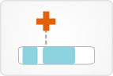

# [Protein View](http://vizome.org/aml/protein/)

## 

### Data
For a given gene, this view displays Pfam domains of the protein it codes, and variants in the study population. Protein data were imported from the Ensembl 75 database (GRCh37 assembly).

Note: this instance of Vizome displays all possible protein consequences, not just ones associated with individual samples. For any individual sample, only the most deleterious variant is "kept" and displayed throughout Vizome. But here in the protein view, all possible consequences are displayed as well, although no longer associated with any sample or patient.

Global filters affect this view. Any sample-based filters set [here](http://vizome.org/aml/) and/or variant filters set [here](http://vizome.org/aml/variant_filter/) determine what transcripts and variants appear in this view. If no global filters are set, all variants and transcripts for a given gene are shown.

### Visuals
Variants are indicated by symbols placed above their position on the protein sequence. Size of the symbol corresponds to the number of samples containing that variant.

Tumor only variants are indicated by a "T" underneath the symbol, on the protein domain.

Variants with an ExAC frequency > 0 are indicated with a *.

A yellow triangle just underneath a variant indicates that it was the variant clicked on in another view that brought you here.

If more than one row appears, each row corresponds to a transcript of the gene.

If none of the rows shown have variant symbols, the variants in the given gene likely do not have a position in the protein sequence (e.g., 3' UTR variants).

### User interactions
Mousing over a variant symbol displays information about it: the type of variant, the amino acid change and protein position, and the number of samples containing that variant.

Clicking on a variant symbol will open a table of sample data for that gene.