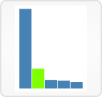
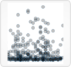
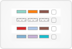

# [Sample Attributes View](http://www.vizome.org/aml/)

This view provides several methods to define a global filter that will limit browsing in Vizome to a subset of samples.

See the Vizome [help page on sample filters](http://www.vizome.org/aml/about_sample_filters/) for instructions and examples.

##  Bar Charts

### Data
This view displays sample attribute data (also referred to as clinical data).

It presents options for defining a global sample-based filter based on sample attributes such as diagnosis and treatment.

A filter set here will affect the data shown in all views that display and/or export sample-based data.

### Visuals
Data appears in bar chart form, with color-coding for current selections.

### User interactions
Click on a small bar graph (category) to open a larger version of it. In the opened chart, click individual bars to select/de-select samples.

When adding more than one category to the table, you may decide whether to combine selections across categories with "Or" or "And" by clicking those buttons at the top left. Note that within a category, selections will always be combined with "Or." It is only across categories that the combination method can change.

Above the small charts, you will see a count of the total number of samples selected. To save this group of samples as a global filter, enter a label for it, if desired, and click "Save this selection as a group." This will affect all views that display and/or export sample-based data, limiting them to only these samples.

After saving one group, you will have the option to repeat the steps to save another group, in order to compare two groups of samples across Vizome. Note that the two groups must be composed of different samples. If any of the samples in your second group are already included in your first group, the second group cannot be saved.

A global sample group filter set here will replace one set in other panels.

##  Scatterplot

### Data
This view displays sample attribute data (also referred to as clinical data).

### Visuals
Samples appear in this plot as circles, with an x and y position determined by clinical data values.

### User interactions
Select a sample attribute from the X axis drop-down menu and one from the Y axis drop-down menu to view a scatterplot.

Control samples can be omitted by checking the "Omit control samples" checkbox.

Clicking "Swap axes" will tranpose the plot.

##  Serial

### Data
This view displays sample attribute data (also referred to as clinical data) sorted by sample date for each patient.

It presents the option of defining a global sample-based filter by hand-selecting samples to be included.

A filter set here will affect the data shown in all views that display and/or export sample-based data.

### Visuals
Data appears in tabular form, with "Timepoints" as columns and patients as rows. Sample attributes are added to the table as color-coded rectangles, with a maximum of four per table cell.

Missing or blank sample attribute values are indicated by a crosshatch pattern.

### User interactions
Select a sample attribute category from the drop-down menu to add it to the table. Colored rectangles will be added to the table, and a legend will appear to the right.

Remove a category from the table by clicking the close button in the legend.

In the legend at right, click the checkbox next to a label to select or deselect all samples with that value at once. Click "hide" to hide values, if desired (and "show" to display them again).

When adding more than one category to the table, you may decide whether to combine selections across categories with "Or" or "And" by clicking those buttons at the top right. Note that within a category, selections will always be combined with "Or." It is only across categories that the combination method can change.

You may select/unselect any individual samples at any time by checking or unchecking the box in the sample's table cell.

Below the table, you will see a count of the total number of samples selected. To save this group of samples as a global filter, enter a label for it, if desired, and click "Save as group." This will affect all views that display and/or export sample-based data, limiting them to only these samples.

A global sample group filter set here will replace one set in other panels.

## List

### Data
No visualizations are displayed in the List panel.

It presents the option of defining a global sample-based filter by entering a list of sample IDs (e.g., "17-00123") to be included.

A filter set here will affect the data shown in all views that display and/or export sample-based data.

### User interactions
Enter a list of sample IDs separated either by commas or line breaks.

To save this list of samples as a global filter, enter a label for it, if desired, and click "Save as group." This will affect all views that display and/or export sample-based data, limiting them to only these samples.

After saving one group, you will have the option to enter a new list of sample IDs to save another group, in order to compare two groups of samples across Vizome. Note that the two groups must be composed of different samples. If any of the samples in your second group are already included in your first group, the second group cannot be saved.

A global sample group filter set here will replace one set in other panels.

## Genetics

### Data
The Genetics panel presents the option of defining a global sample filter based on shared genetic traits. A group of samples can be defined by searching by gene(s) and selecting those samples with the desired variant(s).

Global filters affect the results of searching by gene. Any sample-based filters set here and/or variant filters set here determine what variants will be returned.

A filter set here will affect the data shown in all views that display and/or export sample-based data.

### User interactions
Select a gene via the drop-down menu, and any variants found in that gene will be displayed in tabular form.

The table of results can be sorted by any of the blue underlined column headings (Gene, Start, End, Type, Amino acids, Protein position, Ref, and Alt). Click the headings to sort.

Selecting variants from the results will automatically filter samples to match. Variants can be selected via the "Select all" checkbox at the top of the table, or via individual radio buttons on each row. Selecting "or" will include samples with any of the selected variants, whereas selecting "and" will include only samples with all of the selected variants. Selecting "not" will exclude any samples with that variant. Rows with no radio button selected will be ignored.

As you select rows, the total number of unique samples selected will be updated, below the search results table.

The "Sample data" table below the Genetics panel will also be updated with each selection.

Click the "Start over" button above the search results table at right if you want to remove all rows from the table.

To save the samples you have selected as a global sample filter, give the group a name, if desired, and click "Save as group." This will affect all views that display and/or export sample-based data, limiting them to only these samples.

A global sample group filter set here will replace one set in other panels.
