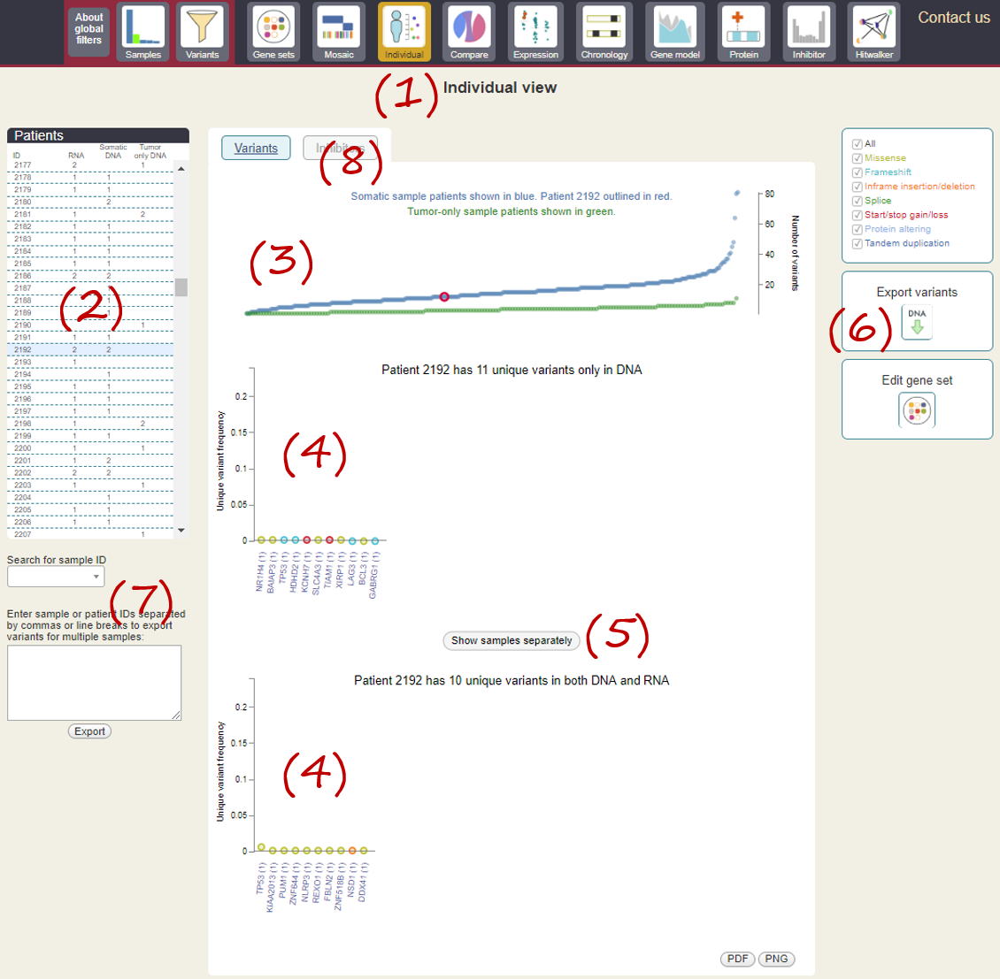
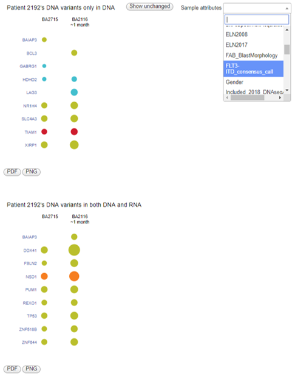
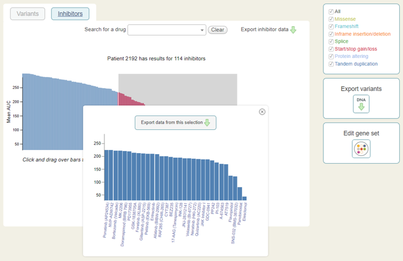

# How to Explore Individual Patients/Samples

This is a screenshot from the Beat AML Vizome (www.vizome.org/aml).

**(1)** Click on the [Individual](http://vizome.org/aml/individual/) module.

**(2)** Click on a patient in the list (2192 is shown here).

**(3)** The selected patient will be highlighted (red circle) in the context of the entire Beat AML cohort.

**(4)** DNA and/or RNA variants for that patient are shown.

**(5)** If the patient has more than one sample, click on "Show samples separately" to examine differences between samples. The "Sample attributes" drop-down menu can be used to label samples with clinical features.

**(6)** "Export variants" allows you to download a CSV of the variants for that patient.

**(7)** You can also search for a specific sample or list of samples.

**(8)** Inhibitor screen results, if the patient has any, can be viewed by selecting the "Inhibitors" tab.

See [Individual](individual.md) help page for more detailed information.

