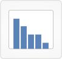

# [Variant Filters and Search](http://www.vizome.org/aml/variant_filter/)

## 

See the Vizome [help page](http://www.vizome.org/aml/about_variant_filters/) for instructions and examples.

### Data
This page presents options for defining global filters based on variant properties such as number of reads and frequency in the population.

It also presents options for searching for variants in both the curated somatic variants dataset and the full Beat AML dataset.

Filters set here will affect the data shown in all views that display and/or export variants.

### User interactions
DNA variant search
Enter a gene name to query the DNA variant database for all variants in that gene, or enter a gene name and an amino acid change to query for a specific variant within that gene.

This query will return all possible variants, regardless of global filters, so can be a helpful check if you're not seeing a variant elsewhere in Vizome, but were expecting to.

The search results are presented in a table, with each row corresponding to a different variant type. All results of the same variant type are concatenated into the same row, with a total number of samples displayed in the first column.

Search results also include ref, alt, chromosome, start position, end position, amino acids, protein position, frequency across samples, allele frequency range, frequency in OHSU AML normals, presence in dbSNP, presence in COSMIC, ExAC MAF, and tumor only indicator. Again, these values are concatenated for many variants and samples, so to focus on specific variants, other Vizome views will be useful.

#### Custom variant sets
Selecting one or more custom variant sets (Jaiswal or TCGA) and clicking "Set filter" will query our variant database and retrieve any that match those defined in the custom set(s). This will be a global filter, restricting the data shown in all views that display and/or export variants to just the matching results.

#### Cohort variant frequency
A minimum or maximum population frequency (or both) can be set as a global filter. Each variant has a calculated value for frequency across all samples. These values do not change, and they are used to include or exclude variants when this global filter is set. For example, to restrict your data to variants found in at least 10% of the sample population, set the minimum to 10 and leave the maximum at 100. This filter affects the data shown in all views that display and/or export variants.

#### Number of reads
A minimum number of reads can be set as a global filter. In the AML database, each variant already has a read count greater than five, so the filter cannot be set to a value less than five. By default, this filter does not operate with a maximum, meaning it will not exclude any variants with more than a certain number of reads. You may elect to change this by checking the box labeled "Limit maximum reads" and then entering a number value in the "Max reads" box. This filter (whether minimum or maximum or both) affects the data shown in all views that display and/or export variants.

#### Variant allele frequency
A minimum variant allele frequency can be set as a global filter. This is the frequency found by dividing the number of alternative allele reads by the number of total reads for a single variant found in a single sample. Minimum should be entered here as a percentage. This filter affects the data shown in all views that display and/or export variants.

#### Variant types
Variant types can be included or excluded with the checkboxes shown. Each variant has one value for "variant type," and those values are used to include or exclude variants when this global filter is set. This filter affects the data shown in all views that display and/or export variants.

#### Presence in samples/databases
Variants found in more than a given percentage of ExAC samples or OHSU AML normals can be filtered out by setting this global filter. In the AML database, variants have already been filtered to keep only those with ExAC < 1%. Variants found in dbSNP can also be filtered out. You may opt to still include variants found in COSMIC, even if they are found in dbSNP or a given percentage of ExAC samples or OHSU AML normals. This filter affects the data shown in all views that display and/or export variants.

##  [Population Frequency View](http://www.vizome.org/aml/freq_summary/)

### Data
This view displays a summary of unique variants grouped by population frequency.

It also displays gene frequencies, calculated as the number of samples with a variant in that gene divided by the total number of samples. The count of samples with a variant in that gene is taken after global filters have been applied.

Global filters affect this view. Any sample-based filters set here and/or variant filters set here determine what variants appear in this view. If no global filters are set, all are shown.

### Visuals
A chart at top summarizes the frequency distribution of unique variants, and underneath it displays the proportion of variant types in each frequency group. Counts per variant type are indicated on the color-coded rectangles.

The bottom plot displays gene frequencies.

### User interactions
For variant type rectangles that are too small to display counts, mouse over them to see those counts.

Drag an area of the gene frequency plot to select a subset of genes and view more information about them, and/or export data from that selection.